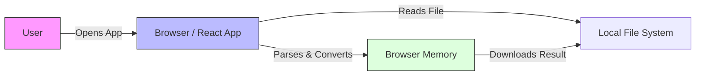
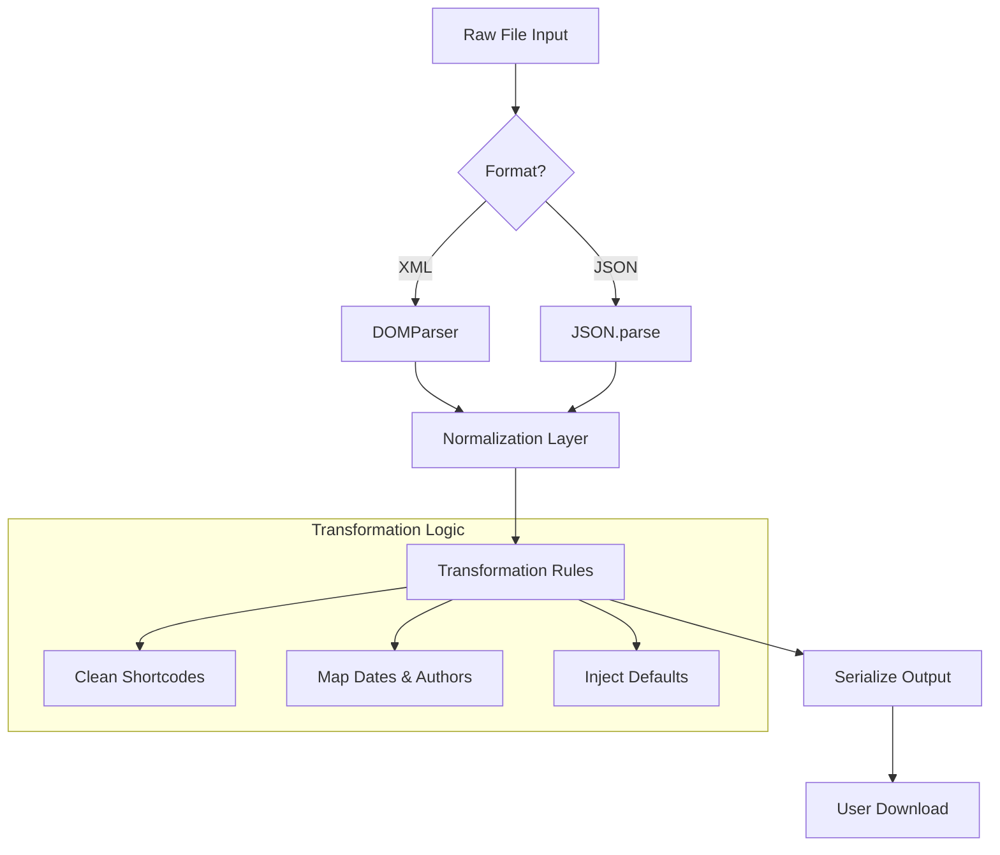
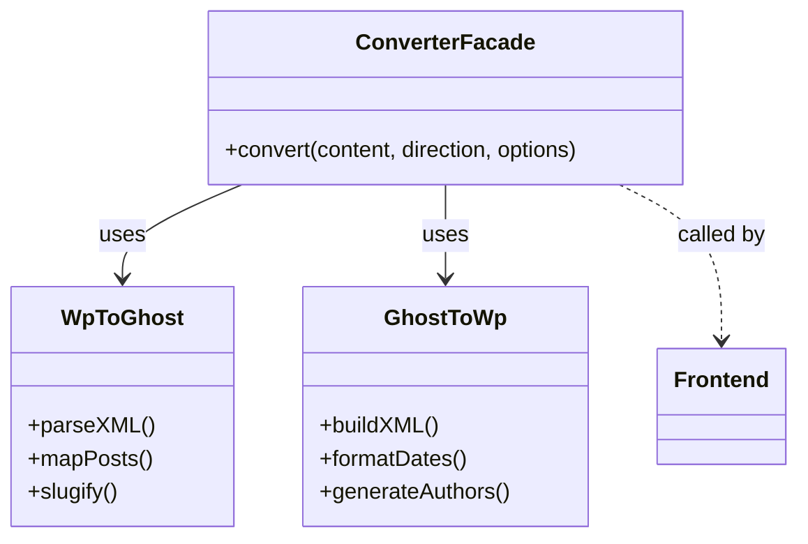

# Architecture & Concepts

**Read Time**: ~5 Minutes
**Scope**: High-level system design and data flow concepts.

---

## 1. System Philosophy: "Privacy by Design"

The `wp2ghost` converter is architected as a **pure client-side application**. Unlike traditional conversion tools that might rely on a backend server to process large files, this application runs entirely within the user's browser.

### Why Client-Side?
*   **Privacy**: Your data (blog posts, user emails, drafts) never leaves your device. There is no API server receiving your XML or JSON files.
*   **Performance**: By eliminating network latency for file uploads and downloads, conversion is near-instantaneous, limited only by the client's CPU.
*   **Simplicity**: The application is delivered as a static bundle, making it trivial to host (e.g., GitHub Pages) and maintain without backend infrastructure.

---

## 2. Core Data Flow: The Conversion Pipeline

Conceptually, the application functions as a detailed transformation pipeline. Whether going from WordPress to Ghost or vice versa, the data travels through three distinct stages: **Ingestion**, **Normalization**, and **Serialization**.

### Stage 1: Ingestion & Parsing
Raw strings (XML or JSON) are ingested from the file upload. 
*   **For WordPress (XML)**: We utilize the native browser `DOMParser` to traverse the XML tree. This is robust and handles the often-messy nature of WXR (WordPress eXtended RSS) files.
*   **For Ghost (JSON)**: We use standard JSON parsing to hydrating the data into JavaScript objects.

### Stage 2: The Converter Logic
This is the "brain" of the application. It maps fields from the source format to the destination schema.
*   **Smart Defaults**: When data is missing (e.g., a Ghost export lacking authors), the system injects valid default objects (like a generic "Administrator") to ensure the output is valid.
*   **Content Sanitization**: Shortcodes (like `[caption]` or `[video]`) are transformed into standard HTML tags, ensuring the content renders safe and correctly on the target platform.
*   **Semantic Versioning**: The system explicitly handles versioning (e.g., Ghost 6.0.0 vs 5.0.0) to ensure field compatibility.

### Stage 3: Serialization
The internal objects are serialized back into the target string format (WXR XML or Ghost JSON), ready for the user to download.

---

## 3. Component Architecture

The codebase is organized to separate **Presentation** (UI) from **Business Logic** (Services).

### The UI Layer (Components)
*   **`ConverterCard`**: The main orchestrator. It manages the state of the application (input/output formats, file content) and handles user interactions.
*   **`FormatSelector`**: A distinct component for managing the complexity of version selection (e.g., selecting specifically Ghost 6.0.0 to satisfy import strictness).

### The Service Layer (Converters)
*   **`wpToGhost.ts`**: Contains the logic to traverse the DOM tree of a WordPress export. It handles the complexity of "flattening" WordPress's relational data (posts, post_meta, terms) into Ghost's document-based structure.
*   **`ghostToWp.ts`**: The reverse engine. It takes Ghost's strict structure and reconstructs the verbose XML required by WordPress, including CDATA wrapping and namespace management.
*   **`converter.ts`**: A wrapper facade that provides a unified interface for the UI, abstracting away the specific converter implementations.

---

## 4. Extensibility & Future Concepts

The current architecture is designed to be **format-agnostic** in the long term. While it currently serves WordPress and Ghost, the `Detection` -> `Normalization` -> `Transformation` pipeline allows for easy addition of new formats.

For example, adding a **Markdown** export would only require a new Service module that hooks into the "Serialization" phase, taking the normalized data and outputting `.md` files instead of JSON or XML.
