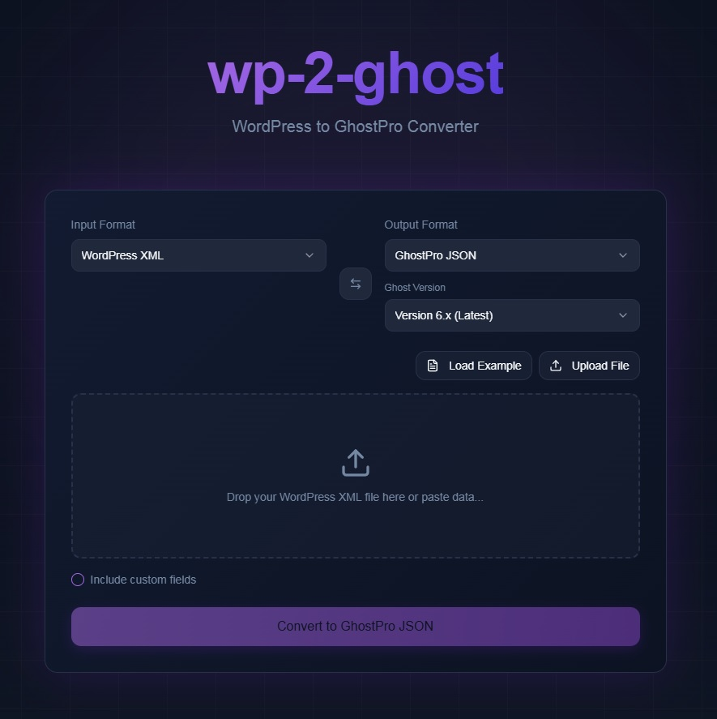

# wp2ghost

A modern, client-side React application to convert WordPress XML exports to Ghost JSON format and vice versa.


This is a fork of [jonhoo/wp2ghost](https://github.com/jonhoo/wp2ghost), updated with a modern React frontend and improved conversion logic for Ghost 6.x.

## Features

- **Bidirectional Conversion**: Convert WordPress XML → Ghost JSON AND Ghost JSON → WordPress XML.
- **Client-Side Processing**: All conversions happen entirely in your browser. Your data never leaves your device.
- **Shortcode Support**: Handles WordPress shortcodes like `[caption]`, `[video]`, and `[audio]`.
- **Ghost Version Support**: Select your target Ghost version (5.x, 6.x) via the UI.
- **Date Handling**: Preserves publication and creation dates across platforms.
- **Tag/Category Mapping**: Automatically maps WordPress categories and tags to Ghost tags.

## Usage

### Live Version
You can use the live version of this tool at: [https://wp2ghost.tonysanchez.dev/](https://wp2ghost.tonysanchez.dev/)

### Local Setup
1. **Clone the repository**:
   ```bash
   git clone https://github.com/RichardAnthonySanchez/wp2ghost.git
   cd wp2ghost
   ```
2. **Install dependencies**:
   ```bash
   npm install
   ```
3. **Start the development server**:
   ```bash
   npm run dev
   ```
4. **Build for production**:
   ```bash
   npm run build
   ```

### How to Convert
1. Upload your WordPress XML export or Ghost JSON file.
2. Choose the target Ghost version (if applicable).
3. Click **Convert**.
4. Download the resulting file or copy the output.

### Import to Ghost
1. Go to your Ghost admin dashboard (e.g., `https://your-site.com/ghost`).
2. Navigate to **Settings > Labs**.
3. Use the **Import content** tool to upload your new JSON file.

## Quality Assurance

We use **Vitest** for testing our conversion services.

```bash
npm test
```

## Contributors

This project builds upon the hard work of the original contributors to the [jonhoo/wp2ghost](https://github.com/jonhoo/wp2ghost) repository. You can see the full list of contributors here:
[Original Contributors List](https://github.com/jonhoo/wp2ghost/graphs/contributors)

## Links

- [WordPress Export Guide](http://en.support.wordpress.com/export/)
- [Wordpress Import Guide](https://docs.ghost.org/migration/wordpress) or [Custom Import Guide](https://docs.ghost.org/migration/custom)

Happy migrating!
